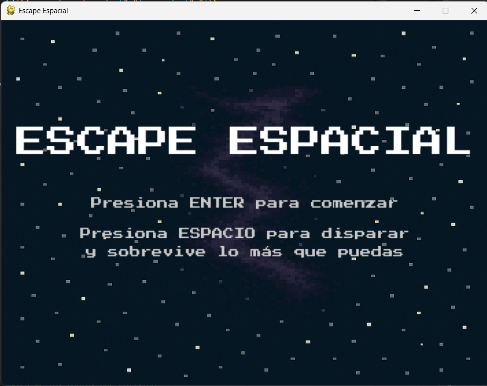
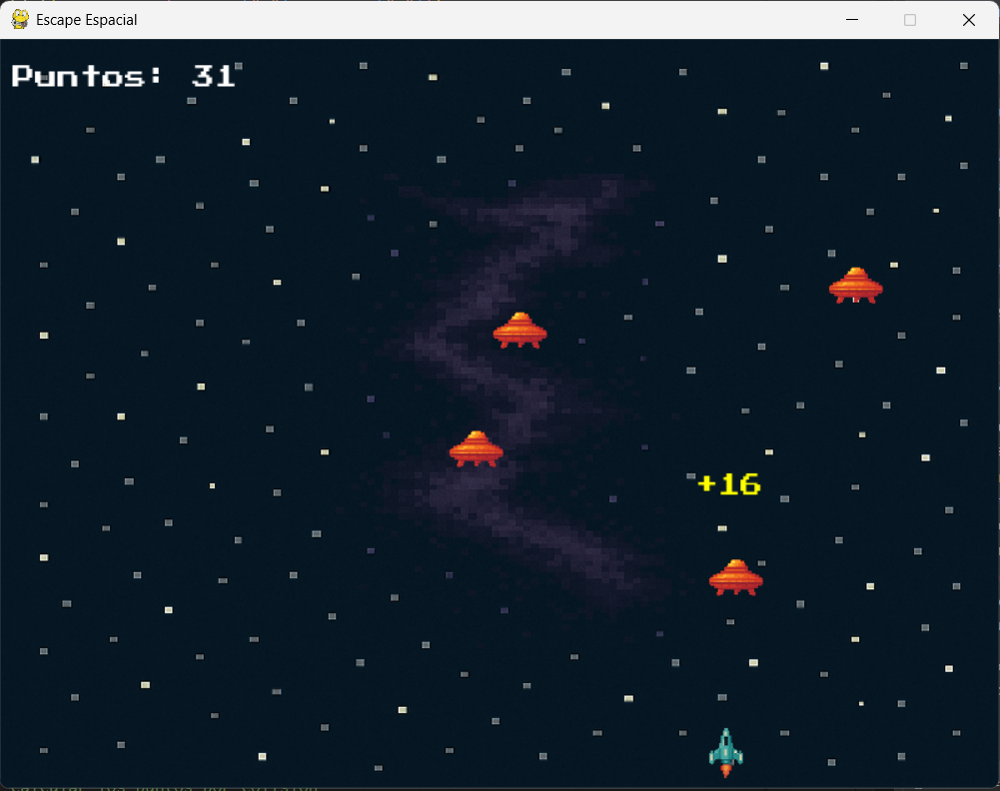
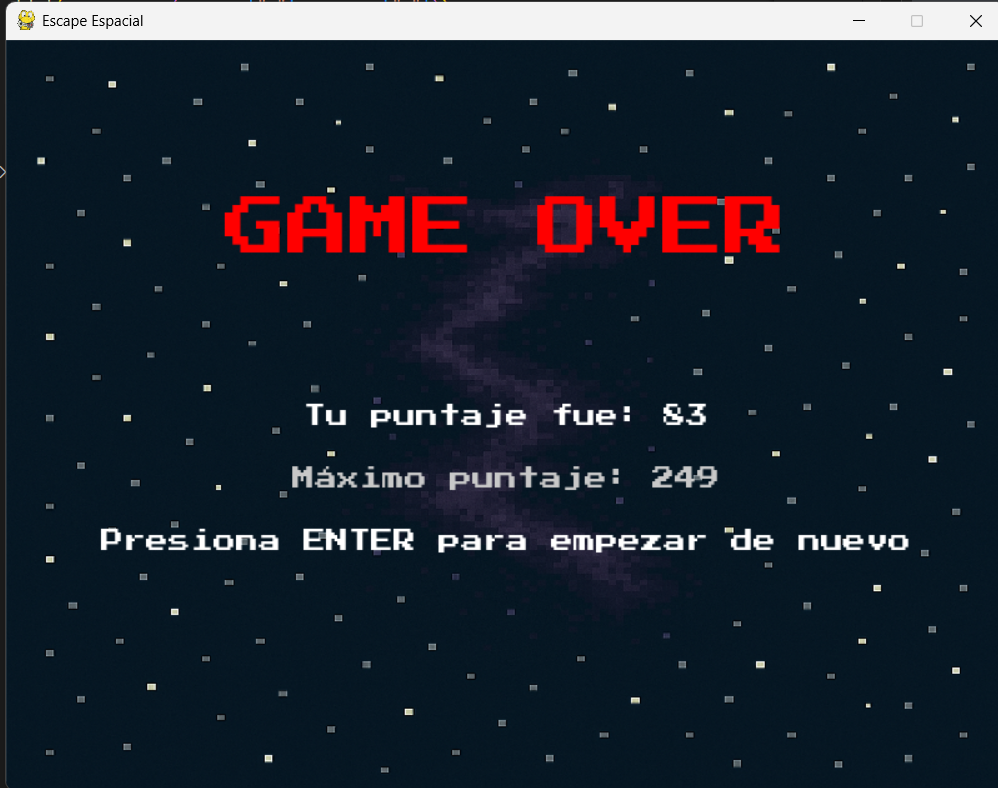

# Escape Espacial

¡Bienvenido a **Escape Espacial**! Un emocionante juego en el que debes sobrevivir el mayor tiempo posible mientras disparas a los enemigos que intentan alcanzar tu territorio y eliminarte a ti.

## Descripción

En **Escape Espacial**, controlas una nave espacial que debe esquivar y destruir enemigos. Gana puntos al eliminar enemigos y compite para superar tu puntaje máximo. Pero ten cuidado: si un enemigo te toca o cruza el borde inferior de la pantalla, ¡el juego termina!

El codigo incluye funciones personalizadas, muchos enemgios que aparecerán en cualquier parte de la pantalla y diferentes menús. 

## Controles

- **Flecha Izquierda (←):** Mover la nave hacia la izquierda.
- **Flecha Derecha (→):** Mover la nave hacia la derecha.
- **Espacio:** Disparar.
- **Escape (ESC):** Pausar el juego.
- **Enter (↵):** Iniciar, reanudar el juego o reiniciar después de un Game Over.

## Características

- **Puntaje dinámico:** Gana puntos según la velocidad de los enemigos que aumenta con el paso del tiempo.
- **Animaciones de puntos:** Muestra los puntos obtenidos al destruir enemigos.
- **Pausa:** Pausa el juego en cualquier momento.
- **Game Over:** Muestra tu puntaje actual y el puntaje máximo alcanzado.
- **Música y efectos de sonido:** Música de fondo y sonidos para disparos, explosiones y Game Over.

## Requisitos

- Python 3.x
- Biblioteca `pygame`

## Instalación

1. Asegúrate de tener Python 3.x instalado en tu sistema.
2. Instala la biblioteca `pygame` ejecutando el siguiente comando en tu terminal:
   ```bash
   pip install pygame

## Estructura de Carpetas

```plaintext
EscapeEspacial/
│
├── main.py                  # Archivo principal del juego
├── README.md                # Archivo de documentación del proyecto
├── intro.png                # Captura de pantalla del menú principal
├── Game.png                 # Captura de pantalla del juego
├── gameover.png             # Captura de pantalla de la pantalla de Game Over
├── assets/                  # Recursos del juego
│   ├── player.png           # Imagen de la nave del jugador
│   ├── enemy.png            # Imagen de los enemigos
│   ├── background.png       # Imagen de fondo
│   ├── Sounds/              # Carpeta para los sonidos
│   │   ├── background_music.mp3      # Música de fondo
│   │   ├── SoundShot.wav             # Sonido de disparos
│   │   ├── SoundExplosionLarge.wav   # Sonido de explosiones
│   │   ├── GameOver.wav              # Sonido de Game Over
│   └── PressStart2P-Regular.ttf      # Fuente utilizada en el juego
```

## Cómo jugar

1. Ejecuta el archivo `main.py`:
   ```bash
   python main.py
   ```
2. En el menú principal:
   - Presiona **Enter** para comenzar el juego.
   - Lee las instrucciones para aprender a jugar.
3. Durante el juego:
   - Usa las flechas para moverte y **Espacio** para disparar.
   - Sobrevive el mayor tiempo posible y elimina enemigos para ganar puntos.
4. Si pierdes:
   - Aparecerá la pantalla de **Game Over** con tu puntaje y el puntaje máximo.
   - Presiona **Enter** para reiniciar el juego.

## Capturas de pantalla

Aquí hay algunas capturas de pantalla del juego:

### Menú principal


### Pantalla de juego


### Pantalla de Game Over


## Créditos

- **Desarrollador:** Luis Felipe Bucheli Checa
- **Recursos:**
  - Imágenes y sonidos obtenidos de ChatGPT y https://opengameart.org.

